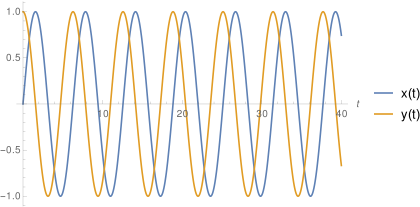
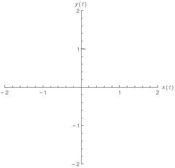
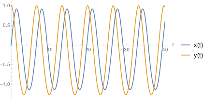
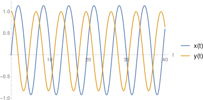
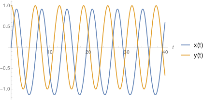
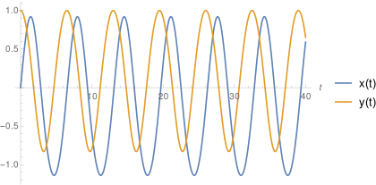
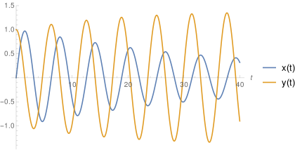
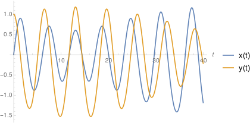
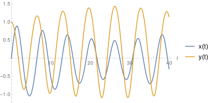
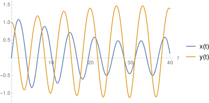

# Home_Work
计算物理作业

## 研究在势函数中添加微扰项对二维偕振子运动轨迹的影响

### 1. 理论分析

势函数：
$$
V(x,y) = a(x^2 + y^2) + e_1x^3+e_2x^3 +e_3x^3y^3
$$
在本次讨论中 $a$ 固定为 $0.5$.

$x, y​$ 方向上的受力分别为:
$$
F_x = - \frac{\partial V}{\partial x} = -(2ax + 3e_1x^2 +3e_3x^2y^3)
$$

$$
F_y = -\frac{\partial V}{\partial y} = -(2ay + 3e_2y^2 + 3e_3x^3y^2)
$$

于是$x, y$ 方向的加速度(设质点质量 $m = 1$):
$$
\frac{d^2x}{dt^2} = \frac{F_x}{m} =  -(2ax + 3e_1x^2 +3e_3x^2y^3)
$$

$$
\frac{d^2y}{dt^2} = \frac{F_y}{m} = -(2ay + 3e_2y^2 + 3e_3x^3y^2)
$$

初始条件:
$$
x(0) = 0 ; \ x'(0) = 1;\ y(0) = 1; \ y'(0) =0
$$

### 2. 结果展示

由$(4)(5)(6)$可得: 

| Case                                | Solution                       | Visualization                |
| ----------------------------------- | ------------------------------ | ---------------------------- |
| $e_1 = e_2=e_3 =0$                  |  |    |
| $e_1 = e_2 = 0.1, e_3 = 0$          |  |  |
| $e_1 = e_2 = -0.1, e_3 = 0$         |  |  |
| $e_1 = 0.1 , e_2 = 0, e_3 = 0$      |  |  |
| $e_1 = 0.1, e_2 = -0.1, e_3 = 0$    |  |  |
| $e_1 = 0, e_2 = 0, e_3 = 0.1$       |  |  |
| $e_1 = 0.1, e_2 = 0.1, e_3 = 0.1$   |  |  |
| $e_1 = 0.1, e_2 = -0.1, e_3 = 0.1$  |  |  |
| $e_1 = -0.1, e_2 = -0.1, e_3 = 0.1$ |  |  |

### 3. 源代码

见`programs`文件夹。