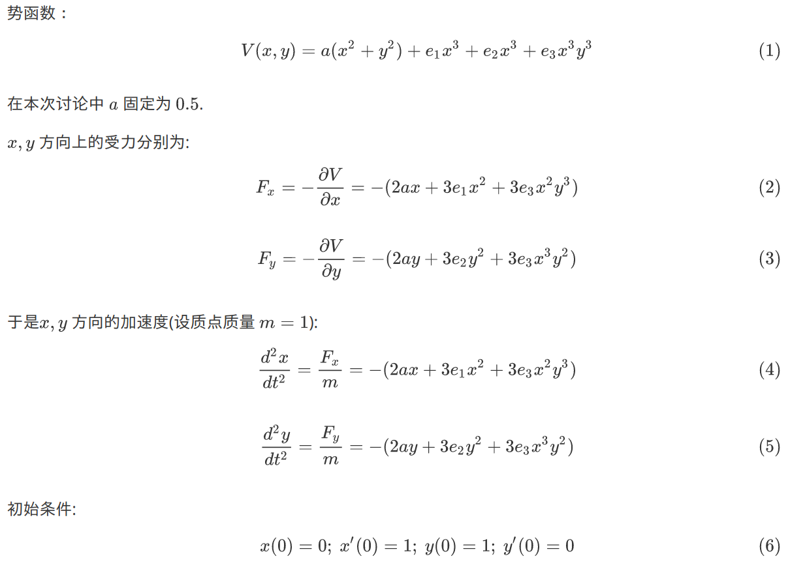

## 研究在势函数中添加微扰项对二维偕振子运动轨迹的影响

### 1. 理论分析

### 2. 结果展示

由$(4)(5)(6)$可得: 

| Case                                | Solution                       | Visualization                |
| ----------------------------------- | ------------------------------ | ---------------------------- |
| $e_1 = e_2=e_3 =0$                  |  |    |
| $e_1 = e_2 = 0.1, e_3 = 0$          |  |  |
| $e_1 = e_2 = -0.1, e_3 = 0$         |  |  |
| $e_1 = 0.1 , e_2 = 0, e_3 = 0$      |  |  |
| $e_1 = 0.1, e_2 = -0.1, e_3 = 0$    |  |  |
| $e_1 = 0, e_2 = 0, e_3 = 0.1$       |  |  |
| $e_1 = 0.1, e_2 = 0.1, e_3 = 0.1$   |  |  |
| $e_1 = 0.1, e_2 = -0.1, e_3 = 0.1$  |  |  |
| $e_1 = -0.1, e_2 = -0.1, e_3 = 0.1$ |  |  |

### 3. 源代码

见`programs`文件夹。